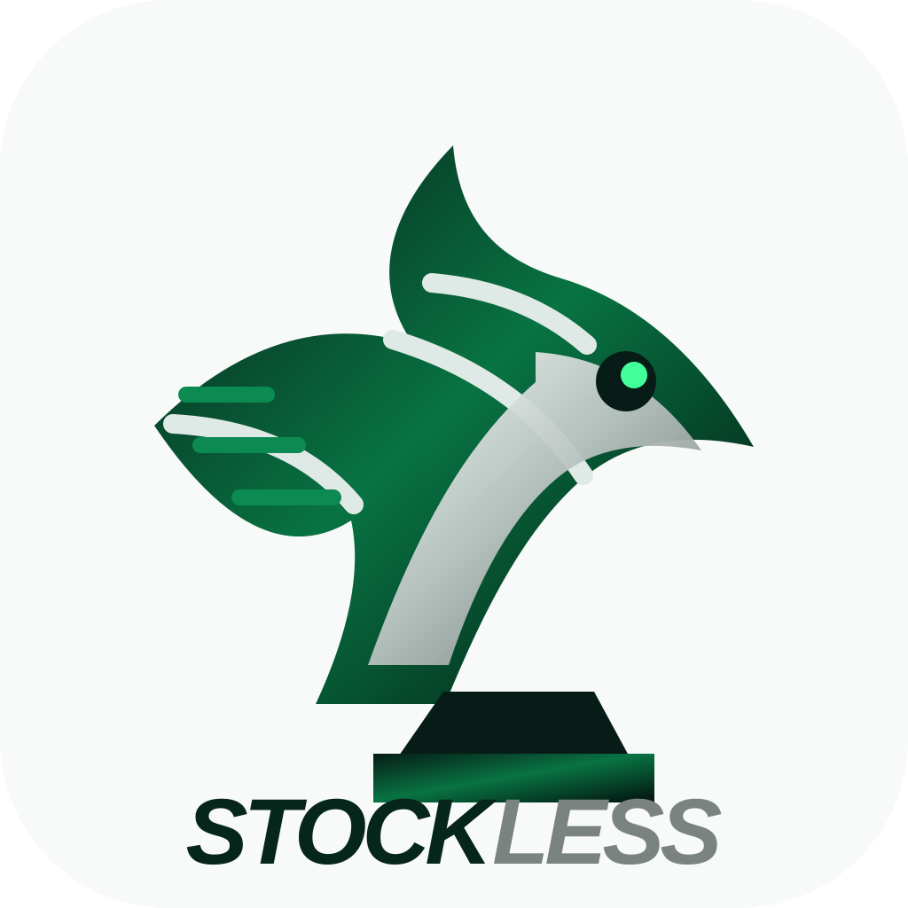

# Stockless

<p align="center"></p>


**Stockless = Stockfish's stable C++ backbone + selectively ported Reckless ideas + a separate Stockless hybrid search policy.**

Current development line: **v0.3-dev**

## Current architecture

| Component | Owner |
|---|---|
| Board / movegen / UCI / SMP / TT / Syzygy | Stockfish |
| Primary NNUE centipawn evaluation | Stockfish |
| LMR/correction-history research source | Reckless 0.10-dev |
| Threat-NNUE research source | Reckless 0.10-dev |
| Hybrid depth controller | Stockless |
| Android mobile profile | Stockless |

Pinned revisions are documented in `docs/UPSTREAM.md`.

## What changed

### v0.2
- Hybrid adjustment moved to the **end of Stockfish's LMR calculation**.
- Reckless-style correction-history sensitivity is folded into a bounded Stockless signal.
- Cut nodes remain conservative unless the move/position is tactically forcing.

### v0.3
- Adds lightweight:
  - `AttackPressure`
  - `KingDanger`
  - `TacticalVolatility`
- These are computed from Stockfish attack maps and feed search depth decisions.
- No second full NNUE is evaluated at every node.
- Android builds automatically enable a lower-cost mobile search profile.

## Clone

```bash
git clone --recurse-submodules https://github.com/gaong5247-cmd/Stockless.git
cd Stockless
```

If already cloned:

```bash
git submodule update --init --recursive
```

## Build on Windows

```powershell
./scripts/build-windows.ps1
```

Or:

```bash
python tools/materialize.py
make -C build/stockless-src/src -j build ARCH=x86-64-avx2
```

The generated binary is named `stockless` / `stockless.exe`.

## DroidFish / Android

GitHub Actions builds:

- `stockless-0.3-arm64-v8a`
- `stockless-0.3-armeabi-v7a`

They target Android 8+ (API 26 toolchain) and are intended to be copied into `DroidFish/uci/`.

See **`docs/DROIDFISH.md`** for exact installation and tuning steps.

## GUI branding

Stockless includes `engine-branding.json` and `assets/stockless-logo.svg`. A compatible GUI can detect the Stockless UCI `id name` / executable and automatically show the bundled logo. See [docs/GUI_BRANDING.md](docs/GUI_BRANDING.md).

## UCI options

```text
StocklessHybrid      true/false
StocklessAggression  0..200
StocklessThreats     true/false
StocklessMobile      true/false
```

Defaults:

- Hybrid: ON
- Aggression: 100
- Threats: ON
- Mobile: ON on Android, OFF on desktop

Set `StocklessHybrid=false` to recover the Stockfish search policy for A/B testing.

## NNUE strategy

Current upstream nets are research inputs, not blindly averaged together.

Stockfish remains the score-producing NNUE path. Reckless's threat accumulator design informs the Stockless threat layer and a future dedicated multi-head network.

The long-term target is one efficient Stockless network with shared features and auxiliary attack/danger outputs, not two expensive full evaluations per node.

## Testing rule

Every meaningful search change should survive:

1. materialization
2. native compile
3. UCI smoke
4. Android cross-compile
5. bench/correctness
6. game testing / SPRT

No untestable giant engine-soup commits.

## Licensing

Stockfish is GPL-3.0-or-later. Reckless is AGPL-3.0. Stockless integration code is distributed under AGPL-3.0 and upstream attribution is retained.
